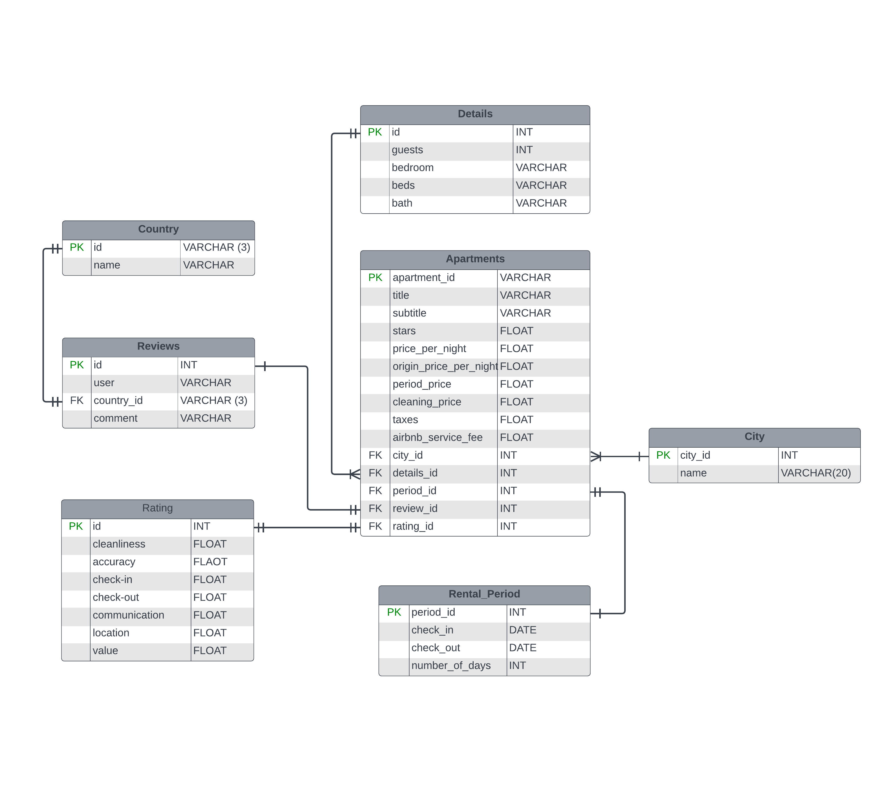

# AirBnB Listings in Poland
A data engineering project using [AirBnB](https://www.airbnb.com) listings in select cities Poland. The data used for this analysis was obtained from AirBnB webpage specifically for the following cities:
1. Warsaw
2. Wrocław
3. Katowice
4. Gdańsk
5. Łodz
6. Kraków
7. Lublin
8. Poznan
9. Zakopane
10. Gliwice
11. Torun
12. Biesko-Biała
13. Gdynia
14. Sosnowiec

## Objectives
This project is aimed at building an ETL pipeline that includes the following:
1. Data collection - webscraping data from airbnb listing page.
2. Cleaning and transformation - extracting useful data from the html, and transforming into a Pandas dataframe.
3. Loading into PostgreSQL database.
4. Orchestrating with airflow.
5. Containerization using docker.

## Approach
1. Build a webcrawler to extract data from AirBnB webpage.
2. Perform transformations on extracted data and load into PostgreSQL database. In situations where extraction fails at the first attempt, it is retried multiple times.
3. Orchestrating process using airflow and containerizing using Docker.
4. Perform exploratory and explanatory analysis to understand price differences between house listings in these cities and also explore the price trend.

The project is divided into the following stages:
1. **Data Extraction:** Developed a web scrapping script (using selenium and beaustifulsoup frameworks) to perform the ETL process involving data extraction from the and performing necessary transformations. The output data is loaded into PostgreSQL staging database, and in situations where the transformation fails, the extracted html data is saved as txt file in MongoDb, and the transformation is retried.
2. **Data Cleaning:** Since the first step is focused on data extractions, data cleaning and feature engineering was performed using PySpark.
3. **Exploratory Analysis:** The data was visualized to understand and derive insights from hidden patterns and trends in the data from different cities and in different months.
4. **Power BI Visualization:** Using the cleaned data, a dashboard will be created to show the patterns uncovered using appropriate visuals. This visualization will enable travellers and tourists make better financial planning based on the season they are visiting Poland and the city they intend to visit, as they will already have an insight to the average cost of an apartment per night.

The project is containerized using docker, the scrapping orchestration carried out using Apache Airflow. All applications: Airflow and PostgreSQL are containerized using Docker.

## Data
The following data were collected from the listings available for each city: 
- Apartment name
- Subtitle
- Location/City
- Number of beds
- Price per night
- Rental period
- Guests
- Bedrooms
- Bath
- check in date
- check out date
- cleaning fee
- Total rental price for the rental period
- Rating (star)
- Number of ratings
- Review ratings (Cleanliness, Accuracy, Check in, Communication, Location, Value)
- Top 3 reviews

## Data Modelling
The data model for this project was performed using the **SNOWFLAKE SCHEMA*** in the 3rd normal form (3NF).The model contains one facts table and three dimension tables all linked directly to the facts table. The dimension tables have a **one to many** and/or **one to one** relationship with the facts table. The tables are as listed below:
1. **City**: A dimension table containing the unique cities considered in this project.
2. **Ratings**: contains the ratings per listing.
3. **Rental_period**: contains the period (number of days) the listing will be available - check in and check out date.
4. **Apartments**: A facts table containing the apartment title, subtitles and id's linked to the dimension tables.
This table also contains the price of each listing. These prices includes price per nigh, original price and total
price per listing.
5. **Details**: further details relating to the listing: beds, bath, quests and bedroom.
6. **Reviews**: Reviews for the listing, with an extende table, **country** which keeps unique reviewer's country.

The ERD (Entity Relationship Diagram) was created using the diagramming tool [LucidChart](https://lucid.app/).

## Run Instructions
1. Ensure Docker Desktop is installed in the OS, and it is running.
2. Run the `docker_setup.bat` in the command line interface. This file is specifically for Windows OS. This will pull all needed images (Airflow, PostgreSQL, MongoDB) and start the containers.
3. The containers are accessible as follows:
    - Airflow: >>> To be added
    - PostgreSQL PgAdmin: >>> To be added
    - Mongo-expres: >>> To be added default user: admin, default password: pass
4. To stop/close the application, run `docker-compose down --volumes --rmi all`. This will close all containers, pull down all the volumes that has been setup and also removed all pulled docker images.

## Airflow
>>> To be added

## PostgreSQL
>>> To be added

## Questions
TODO

## Insights
TODO
