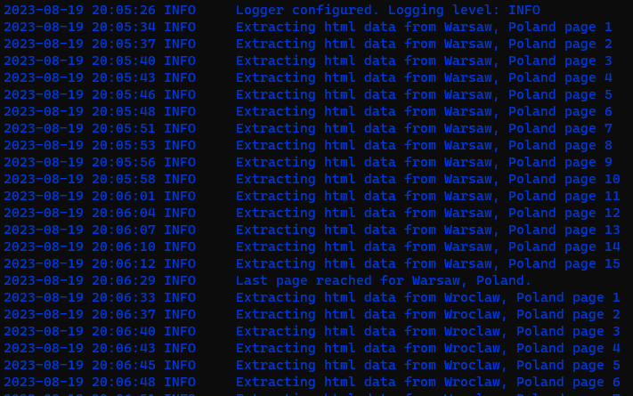
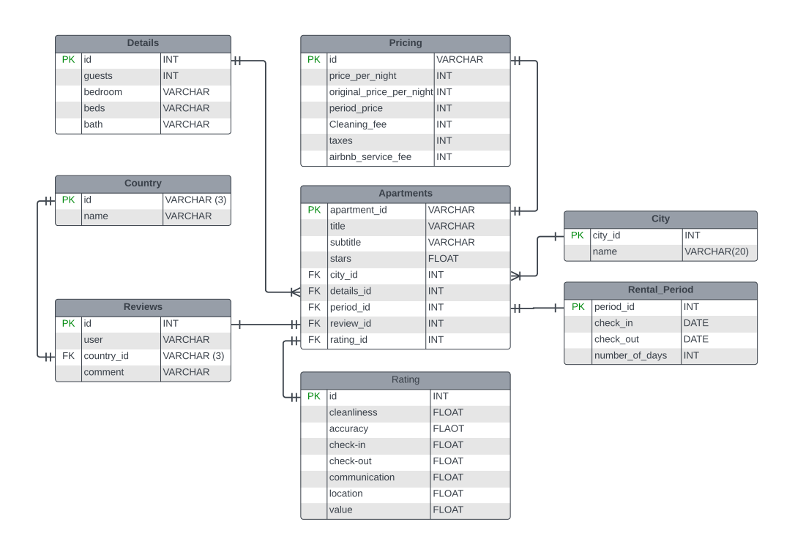

# AirBnB Listings in Poland
An analysis of [AirBnB](https://www.airbnb.com) price listing in Poland's major cities for a duration of six months
starting from October 2023. The data used for this analysis was scraped out of AirBnB webpage, specifically for select
16 cities in Poland which includes but might not be limited to:
1. Warsaw
2. Wrocław
3. Katowice
4. Gdańsk
5. Łodz
6. Kraków

... for a full list of cities considered in this project, see the **cities.csv** file.

## Objectives
This project was based on finding out and comparing the AirBnB rental listing prices for different accomodations
available in these cities for different months of the year.

## Files
1. **Configuration.py:** contains directories to data source and location where output file will be saved. The url, and
months are also included in this file.
2. **logger.py:** display data extraction on the command line.
3. **scrape_data.py:** Data extraction script written in python.
4. **log_data....txt:** A text file containing log informations.

## Data
AirBnB price listing data for the above mentioned cities were gathered on a monthly basis, specifically at the middle
of each month (3rd week of the month) for a period of 6 months starting from August 2023. The data collected included:
- Apartment name
- Location/City
- Number of beds
- Price per night
- Rental period
- Total rental price for the rental period
- Rating (star)
- Number of ratings

## Approach
1. Build a webcrawler to extract data from AirBnB webpage. This script is run on a daily basis, extracting available
data from AirBnB webpage.
2. Perform transformations on extracted data and save output file.
3. Carryout exploratory and explanatory analysis to understand price differences between house listings and also
explore the price trend.

The project is divided into the following stages:
1. **Data Extraction:** Developed a web scrapping script (using selenium and beaustifulsoup frameworks) to perform the
ETL process involving data extraction from the and performing necessary transformations. Final data is saved as a
CSV file.
2. **Data Cleaning:** Since the first step is focused on data extractions, data cleaning and feature engineering was
performed using an cloud platform: Azure Databaricks.
3. **Exploratory Analysis:** The data was visualized to understand and derive insights from hidden patterns and trends
in the data from different cities and in different months.
4. **Power BI Visualization:** Using the cleaned data, a dashboard was created to show the patterns uncovered using
appropriate visuals. This visualization will enable travellers and tourists make better financial planning based on
the season they are visiting Poland and the city they intend to visit, as they will already have an insight to the
average cost of an apartment per night.

#### Logging display during data extraction

#### Exception log

## Data Modelling
The data model for this project was performed using the **STAR SCHEMA*** in the 3rd normal form (3NF).The model
contains one facts table and three dimension tables all linked directly to the facts table. The dimension tables have
a **one to many** and/or **one to one** relationship with the facts table. The tables are as listed below:
1. **Cities**: A dimension table containing the unique cities considered in this project.
2. **Beds**: contains the unique number of beds in the listing, linked to the facts table using their id.
3. **Rental_period**: contains the period (number of days) in which the listing will be available.
4. **Apartments**: A facts table containing the apartment title, subtitles and id's linked to the dimension tables.
This table also contains the price of each listing. These prices includes price per nigh, original price and total
price per listing.

The ERD (Entity Relationship Diagram) was created using the diagramming tool [LucidChart](https://lucid.app/).

## Questions
TODO
## Insights
TODO
