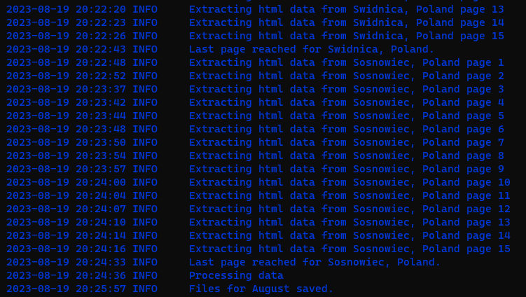

# AirBnB_Listings_in_Poland
An analysis of [AirBnB](https://www.airbnb.com) price listing in Poland's major cities during for a duration of
six months starting from August 2023. The data used for this analysis was scraped out of AirBnB webpage, specifically
for the 16 cities in Poland which includes but might not be limited to:
1. Warsaw
2. Wrocław
3. Katowice
4. Gdańsk
5. Łodz
6. Kraków
... for a full list of cities considered in this project, see the **cities.csv** file.

# Objectives
This project was based on finding out and comparing the AirBnB rental listing prices for different accomodations
available in these cities for different months and period of the year. The project is divided into the following
stages:
1. **Data Extraction**: Developed an web scrapping script using selenium, and beaustifulsoup frameworks, to perform the
ETL process involving extracting data from html data and performig necessary transformations. Final data is saved as a
CSV file.
2. **Data Cleaning**: Since the first step is focused on data extractions, data cleaning and feature engineering was
performed using jupyter notebook.
3. **Exploratory Analysis**: The data eeas visualized to understand and derive insights from hidden patterns and trends
in the data from different cities and in different months.
4. **Power BI Visualization**: Using the cleaned data, a dashboard was created to show the patterns uncovered using
appropriate visuals. This visualization will enable travellers and tourists make better financial planning based on
the season they are visiting Poland and the city they intend to visit, as they will already have an insight to the
average cost of an apartment per night.

# Files
1. Configuration.py: contains directories to data source and location where output file will be saved. The url, and
months are also included in this file.
2. logger.py: display data extraction on the command line.
3. scrape_data.py: Data extraction script written in python.

# Data
AirBnB price listing data for the above mentioned cities were gathered on a monthly basis, specifically at the middle
of each month (3rd week of the month) for a period of 6 months starting from August 2023. The data collected included:
- Apartment name
- Location/City
- Number of beds
- Price per night
- Rental period
- Total rental price for the rental period
- Rating (star)
- Number of ratings

# Approach
1. Develop script to extract data from AirBnB webpage on a monthly basis
2. Extract,transform and save to drive/database.
3. Perform exploratory analysis to understand price differences between house listings and also price trend.

### Logging display during data extraction

# Questions
TODO
# Insights
TODO
