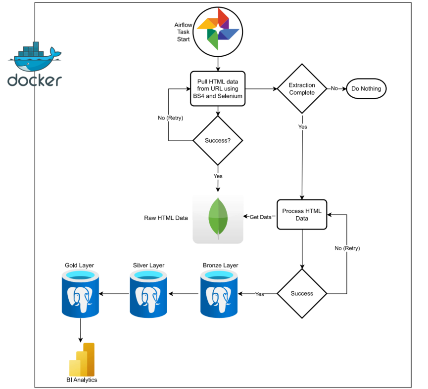
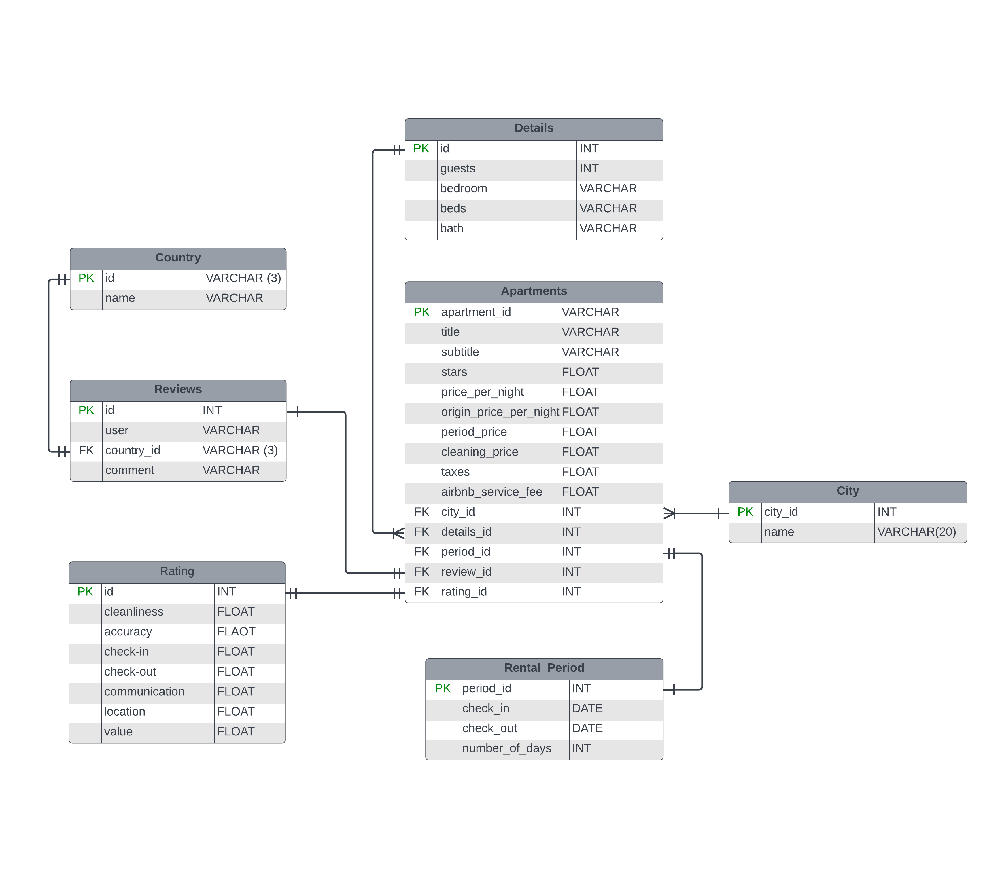

# AirBnB Listings Data Engineering Project
## Overview
This project is an end-to-end data engineering solution built to collect, process, store, and analyze Airbnb listings across selected cities in Poland. The goal is to provide insights into pricing trends, listing characteristics, and seasonal patterns to support better travel and financial planning.

## Cities Covered
1. Warsaw
2. Wrocław
3. Katowice
4. Gdańsk
5. Łodz
6. Kraków
7. Lublin
8. Poznan
9. Zakopane
10. Gliwice
11. Torun
12. Biesko-Biała
13. Gdynia
14. Sosnowiec

## Objectives
The project focuses on building a robust and scalable ETL pipeline that includes:
1. Web scraping Airbnb listings for selected Polish cities
2. Cleaning and transforming raw HTML data into structured Pandas dataframes
3. Loading processed data into a PostgreSQL database via FastAPI endpoints
4. Orchestrating workflows with Apache Airflow
5. Containerizing all services using Docker
6. Performing exploratory and explanatory data analysis
7. Creating business-focused dashboards using Power BI

## Architecture & Approach
1. **Data Extraction**: A web crawler was developed using Selenium and BeautifulSoup to scrape Airbnb listing data for selected cities.
2. **Data Transformation & Cleaning**: Extracted HTML data is parsed, cleaned, and transformed into structured formats using Pandas, including feature engineering and data validation.
3. **Data Loading**: Cleaned data is loaded into a PostgreSQL database through a robust FastAPI backend to ensure secure and scalable ingestion.
4. **Orchestration**: Apache Airflow is used to orchestrate the entire ETL workflow, ensuring reliable scheduling and monitoring.
5. **Containerization**: All components (Airflow, PostgreSQL, FastAPI) are containerized using Docker for portability and reproducibility.
6. **Analysis & Visualization**: Exploratory and explanatory analysis is performed to uncover pricing trends, listing characteristics, amenities distribution, and seasonal variations. Results are visualized using Power BI dashboards.

### Flow Diagram

## Data
The following attributes are extracted for each listing:
- Apartment Id
- Apartment name/title
- Location/City
- Number of beds
- Price per night
- Rental period
- Guests
- Bedrooms
- Bath
- check in date
- check out date
- Ammenities - (as presence of bathtub, kitchen, iron, oven, electric kettle, heating, etc)
- Star
- Number of ratings
- Review ratings (Cleanliness, Accuracy, Check in, Communication, Location, Value)
- Top 3 reviews

## Data Modelling
The data model for this project follows a Snowflake Schema design in Third Normal Form (3NF). It consists of one central fact table and multiple dimension tables, all directly linked to the fact table. The relationships between the fact and dimension tables are one-to-many and one-to-one, ensuring data integrity and efficient querying.

### Tables Overview
1. **City**: A dimension table containing the unique cities.
2. **Ratings**: Stores rating information associated with each listing..
3. **Rental_period**: Contains availability details for listings, including check-in and check-out dates and rental duration.
4. **Apartments**: The central fact table containing apartment IDs, titles, and references to related dimension tables. It also stores pricing details such as price per night, original price, and total price per listing.
5. **Details**: Holds additional listing attributes, including number of beds, bathrooms, bedrooms, and guest capacity.
6. **Reviews**: Stores reviews for each listing, with an extended Country table that maintains unique reviewer country information.

### Entity Relationship Diagram (ERD).

## Run Instructions
1. Ensure Docker Desktop is installed in the OS, and it is running.
2. Run the `docker_setup.bat` in the command line interface. This file is specifically for Windows OS. This will pull all needed images (Airflow, PostgreSQL, MongoDB) and start the containers.
3. The containers are accessible as follows:
    - Airflow: >>> To be added
    - PostgreSQL: >>> To be added
    - API Endpoints >>> To be added
4. To stop/close the application, run `docker-compose down --volumes --rmi all`. This will close all containers, pull down all the volumes that has been setup and also removed all pulled docker images.

## Airflow
>>> To be added

## API Endpoints
>>> To be added

## Questions
TODO

## Insights
TODO

## Tech Stack:
- languages: Python, SQL, Bash
- Web Scraping: Selenium, BeautifulSoup
- Data Processing: Pandas
- Orchestration: Apache Airflow
- Databases: PostgreSQL, MongoDB
- Containerization: Docker
- Visualization: Power BI